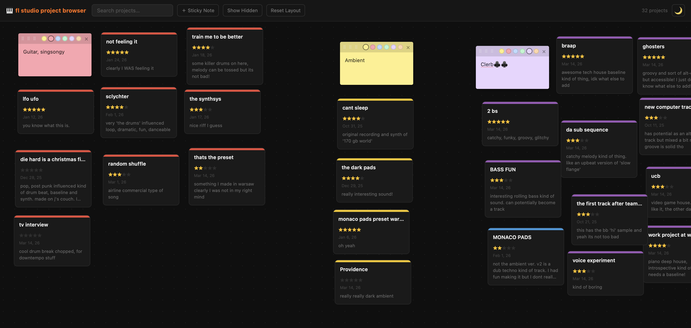

# FL Studio Project Browser



A local web app that displays all your FL Studio projects on a draggable whiteboard. Tag projects by colour, write notes, rate them, and open them directly in FL Studio, all from your browser.

---

## Requirements

- **Python 3.8 or later** — [download here](https://www.python.org/downloads/)
- **FL Studio** installed with projects saved in the default location:
  - macOS: `~/Documents/Image-Line/FL Studio/Projects`
  - Windows: `Documents\Image-Line\FL Studio\Projects`

---

## Setup & Running

### macOS

1. Open Terminal
2. Navigate to the project folder:
   ```bash
   cd path/to/fl-studio-project-browser
   ```
3. Make the run script executable (first time only):
   ```bash
   chmod +x run.sh
   ```
4. Run the app:
   ```bash
   ./run.sh
   ```

The first time you run it, the script automatically creates a Python virtual environment (so it doesn't mess up your global packages!) and installs dependencies. After that it starts up instantly.

Your browser will open automatically at `http://localhost:8765`.

---

### Windows

1. Open File Explorer and navigate to the project folder
2. Double-click **`run.bat`**

   Or from Command Prompt:
   ```cmd
   cd path\to\fl-studio-project-browser
   run.bat
   ```

The first time you run it, the script automatically creates a Python virtual environment (so it doesn't mess up your global packages!) and installs dependencies. After that it starts up instantly.

Your browser will open automatically at `http://localhost:8765`.

> **Note:** If Python isn't recognised, make sure you checked "Add Python to PATH" during installation. Re-run the Python installer and enable that option if needed.

---

## Configuration

When you open the app for the first time, a setup screen will appear asking you to point it at your FL Studio Projects folder.

- Click **Browse…** to open a native folder picker (macOS Finder / Windows Explorer)
- Or type / paste the path directly into the text box
- Click **Open Browser** to save and load your projects

The path is stored in `data.json` and remembered on every subsequent launch. To point the app at a different folder later, click **📁 Change Folder** in the header at any time.

---

## Features

| Feature | How to use |
|---|---|
| **Easily view all projects** | All FL Studio project folders appear as cards on the board, arrange them however you like! |
| **Open in FL Studio** | Click a project → click **Open in FL Studio** |
| **Colour tag** | Click a card → pick a colour (for organising for purpose/genres/anything) |
| **Star rating** | Is it a flop or an upcoming hit? You decide! |
| **Notes** | Write a note for each project (auto-saves) |
| **Sticky notes** | For further organization |
| **Hide a project** | Click a card → **Hide from project browser** at the bottom |
| **Show hidden** | Click **Show Hidden** in the header to reveal hidden projects (and bring back any you no longer want hidden) |
| **Search** | Type in the search box to filter cards by name |
| **Reset layout** | Click **Reset Layout** to snap all cards back to the default grid|
| **Change folder** | Click **📁 Change Folder** in the header to pick a different projects directory |
| **Light/dark mode** | Click the 🌙/☀️ button in the top-right corner |

---

## Data & Privacy

Your project file metadata, ratings, notes, colours, and card positions are saved locally in `data.json` in the project folder. This file is excluded from git (via `.gitignore`) so your personal data is never committed or shared in case you cloned this repo. I don't (and have absolutely no way to) recieve any data from your projects.

---

## Stopping the app

Go back to the terminal / command prompt and press `Ctrl + C`, or simply close it.

---

## Acknowledgement

This was vibecoded and tested in the span of 30 minutes using Claude Code. This code is open source under the [GNU General Public License v3](LICENSE).